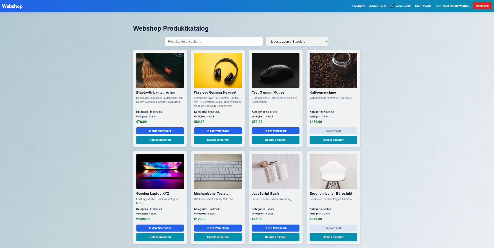
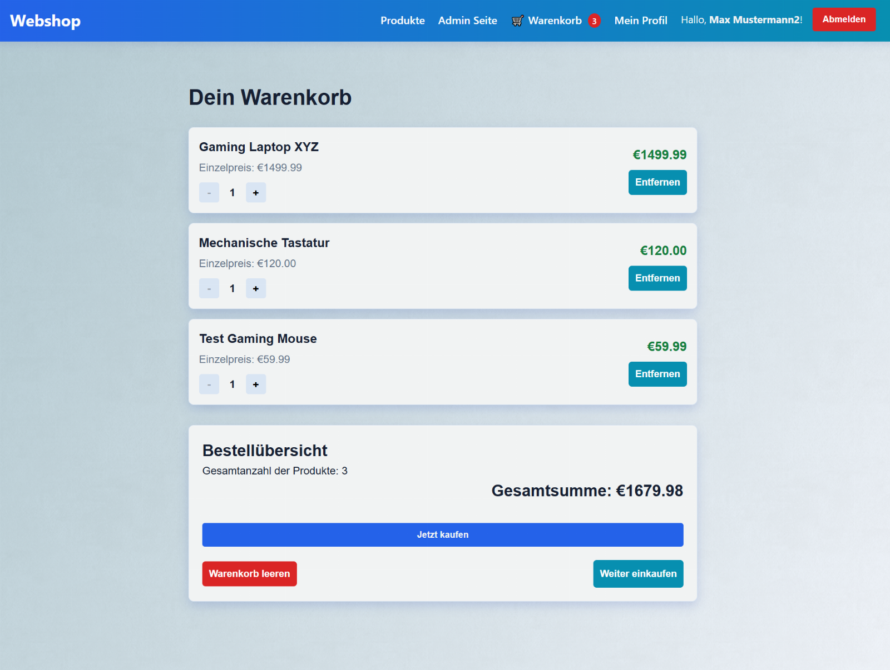
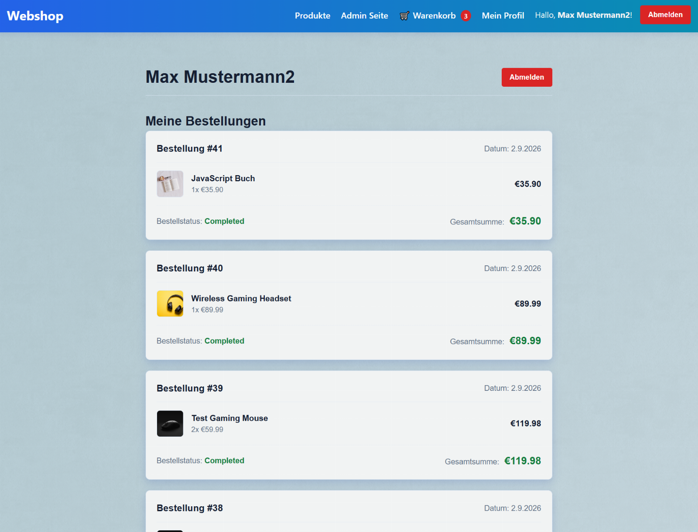
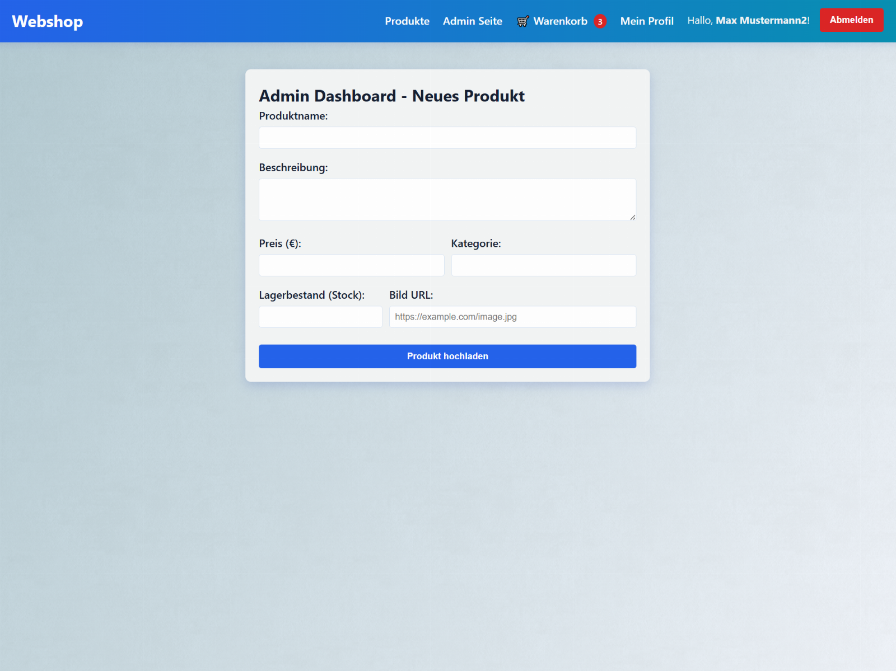

# React Node Webshop App

A full-stack e-commerce portfolio project built with React, Node.js, Express and PostgreSQL.

Live Demo: [React Node Webshop App](https://react-node-webshop-app.vercel.app/)  

This README is available in English and German.

---

# English

## Overview

React Node Webshop App is a full-stack e-commerce application developed with React, Node.js, Express and PostgreSQL.

The application allows users to browse and search products, manage a shopping cart, create an account, log in and place demo orders. Registered users can view their previous orders, while administrator accounts have access to protected product management functionality.

The project focuses on combining frontend development, REST API communication, authentication, database management and server-side business logic in one application.

## Features

### Product Catalogue

* Display products in a responsive product catalogue
* View detailed information about individual products
* Search products by name or description
* Display product availability and stock
* Disable purchasing for out-of-stock products
* Debounced product search
* Sort products by price
* Visual feedback when adding products to the cart
* Prevent adding quantities beyond available stock

### Shopping Cart

* Add products to the shopping cart
* Increase or decrease product quantities
* Remove individual products
* Clear the complete cart
* Automatic calculation of the total price
* Persist the shopping cart in LocalStorage

### Authentication

* User registration
* User login
* Password hashing with bcryptjs
* JWT-based authentication
* Protected routes
* Role-based authorization
* SessionStorage-based user session handling
* Logout functionality

### Orders

* Create orders from the shopping cart
* Store orders and individual order items in PostgreSQL
* Calculate order prices on the backend
* Validate product stock before creating an order
* Automatically reduce stock after a successful order
* Database transactions with rollback on errors
* PostgreSQL row locking during order processing
* Display personal order history in the user profile

### Admin

* Protected administrator area
* Role-based access control
* Add new products
* Define product name, description, category, price, stock and image URL
* Server-side and client-side product validation

## Technologies

### Frontend

* React
* JavaScript
* Vite
* React Router
* React Context API
* Axios
* LocalStorage
* SessionStorage
* HTML5
* CSS3
* Responsive design

### Backend

* Node.js
* Express.js
* REST API
* JSON Web Token (JWT)
* bcryptjs
* Helmet
* CORS
* dotenv

### Database

* PostgreSQL
* pg
* SQL transactions
* Foreign keys
* CHECK constraints
* Row locking with `SELECT ... FOR UPDATE`

## Database Structure

The application uses four main database tables:

* `users` – registered users and roles
* `products` – product information and stock
* `orders` – customer orders
* `order_items` – individual products belonging to an order

Relationships between the tables are managed with foreign keys.

## Project Goal

The goal of this project was to build a complete full-stack application and practise the interaction between a React frontend, an Express REST API and a PostgreSQL database.

The project demonstrates authentication, authorization, state management, database relationships, order processing, stock management, SQL transactions and frontend-backend communication.

The checkout currently represents a demo order process and does not process real payments.

## Running the Project Locally

Clone the repository:

```bash
git clone https://github.com/laci528-creator/React-Node-webshop-app.git
```

Install the root dependencies:

```bash
npm install
```

Install the frontend dependencies:

```bash
cd client
npm install
```

Install the backend dependencies:

```bash
cd ../server
npm install
```

Create the required .env files based on the included .env.example files and configure the PostgreSQL database.

The database structure can be created using:

`server/database/init.sql`

Optional sample product data can be inserted using:

`server/database/seed.sql`

Start both the frontend and backend from the project root:

```bash
npm run dev
```

## Screenshots

### Product Catalogue



### Shopping Cart


A
### User Profile



### Admin Dashboard



---


# Deutsch

## Überblick

React Node Webshop App ist eine Full-Stack-E-Commerce-Anwendung, die mit React, Node.js, Express und PostgreSQL entwickelt wurde.

Die Anwendung ermöglicht es Benutzern, Produkte anzusehen und zu durchsuchen, einen Warenkorb zu verwalten, ein Benutzerkonto zu erstellen, sich anzumelden und Demo-Bestellungen aufzugeben. Registrierte Benutzer können ihre bisherigen Bestellungen in ihrem Profil ansehen. Administratoren haben zusätzlich Zugriff auf einen geschützten Bereich zur Produktverwaltung.

Der Schwerpunkt des Projekts liegt auf der Verbindung von Frontend-Entwicklung, REST-API-Kommunikation, Authentifizierung, Datenbankverwaltung und serverseitiger Geschäftslogik.

## Funktionen

### Produktkatalog

* Anzeige der Produkte in einem responsiven Produktkatalog
* Detailansicht einzelner Produkte
* Suche nach Produktname oder Beschreibung
* Anzeige des aktuellen Lagerbestands
* Deaktivierung des Kaufs bei ausverkauften Produkten
* Produktsuche mit Debouncing
* Sortierung der Produkte nach Preis
* Visuelles Feedback beim Hinzufügen von Produkten zum Warenkorb
* Begrenzung der Produktmenge auf den verfügbaren Lagerbestand

### Warenkorb

* Produkte zum Warenkorb hinzufügen
* Produktmenge erhöhen oder reduzieren
* Einzelne Produkte entfernen
* Gesamten Warenkorb leeren
* Automatische Berechnung des Gesamtpreises
* Speicherung des Warenkorbs im LocalStorage

### Authentifizierung

* Benutzerregistrierung
* Benutzeranmeldung
* Passwort-Hashing mit bcryptjs
* JWT-basierte Authentifizierung
* Geschützte Routen
* Rollenbasierte Zugriffskontrolle
* Speicherung der Benutzersitzung im SessionStorage
* Abmeldefunktion

### Bestellungen

* Erstellung von Bestellungen aus dem Warenkorb
* Speicherung von Bestellungen und Bestellpositionen in PostgreSQL
* Berechnung der Bestellsumme auf dem Backend
* Überprüfung des Lagerbestands vor der Bestellung
* Automatische Reduzierung des Lagerbestands nach erfolgreicher Bestellung
* Datenbanktransaktionen mit Rollback bei Fehlern
* PostgreSQL Row Locking während der Bestellverarbeitung
* Anzeige der persönlichen Bestellhistorie im Benutzerprofil

### Adminbereich

* Geschützter Administratorbereich
* Rollenbasierte Zugriffskontrolle
* Neue Produkte hinzufügen
* Produktname, Beschreibung, Kategorie, Preis, Lagerbestand und Bild-URL verwalten
* Client- und serverseitige Validierung der Produktdaten

## Verwendete Technologien

### Frontend

* React
* JavaScript
* Vite
* React Router
* React Context API
* Axios
* LocalStorage
* SessionStorage
* HTML5
* CSS3
* Responsives Design

### Backend

* Node.js
* Express.js
* REST API
* JSON Web Token (JWT)
* bcryptjs
* Helmet
* CORS
* dotenv

### Datenbank

* PostgreSQL
* pg
* SQL-Transaktionen
* Foreign Keys
* CHECK Constraints
* Row Locking mit `SELECT ... FOR UPDATE`

## Datenbankstruktur

Die Anwendung verwendet vier zentrale Datenbanktabellen:

* `users` – registrierte Benutzer und Benutzerrollen
* `products` – Produktinformationen und Lagerbestand
* `orders` – Bestellungen
* `order_items` – einzelne Positionen einer Bestellung

Die Beziehungen zwischen den Tabellen werden über Foreign Keys verwaltet.

## Projektziel

Ziel dieses Projekts war es, eine vollständige Full-Stack-Anwendung zu entwickeln und die Zusammenarbeit zwischen einem React-Frontend, einer Express-REST-API und einer PostgreSQL-Datenbank praktisch umzusetzen.

Das Projekt demonstriert Authentifizierung, Autorisierung, State Management, Datenbankbeziehungen, Bestellverarbeitung, Lagerverwaltung, SQL-Transaktionen sowie die Kommunikation zwischen Frontend und Backend.

Der aktuelle Checkout stellt einen Demo-Bestellprozess dar und verarbeitet keine echten Zahlungen.

## Projekt lokal starten

Repository klonen:

```bash
git clone https://github.com/laci528-creator/React-Node-webshop-app.git
```

Abhängigkeiten im Hauptverzeichnis installieren:

```bash
npm install
```

Frontend-Abhängigkeiten installieren:

```bash
cd client
npm install
```

Backend-Abhängigkeiten installieren:

```bash
cd ../server
npm install
```

Die benötigten .env -Dateien anhand der vorhandenen .env.example -Dateien erstellen und die PostgreSQL-Datenbank konfigurieren.

Die Datenbankstruktur kann mit folgender Datei erstellt werden:

`server/database/init.sql`

Optionale Beispieldaten können anschließend mit folgender Datei eingefügt werden:

`server/database/seed.sql`

Frontend und Backend anschließend aus dem Hauptverzeichnis gemeinsam starten:

```bash
npm run dev
```
